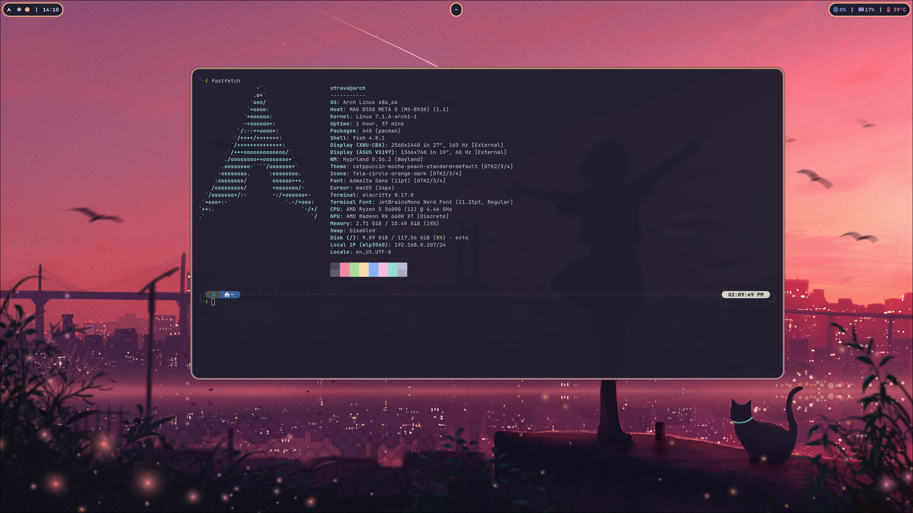

# dotfiles

My personal custom Hyprland environment configured purely in Lua.


## System Features
* Window Manager: Hyprland (Lua config)
* Locker: Hyprlock
* Terminal: Alacritty
* Shell: Fish
* Bar: Waybar
* Launcher: Wofi
* Logout Menu: Wlogout
* Screenshots: Grim + Wl-clipboard

## Installation

```bash
git clone https://github.com/o0travaa/dotfiles.git
cd dotfiles
chmod +x install.sh
./install.sh
```

## Optional Neovim Setup

```bash
sudo pacman -S nvim
git clone https://github.com/LazyVim/starter ~/.config/nvim
rm -rf ~/.config/nvim/.git
```

## Keybindings

| Keybinding | Action |
| --- | --- |
| `SUPER + Return` | Open Terminal (Alacritty) |
| `SUPER + Backspace` | Close Window |
| `SUPER + Escape` | Open Logout Menu (Wlogout) |
| `SUPER + Space` | Switch Keyboard Layout |
| `SUPER + E` | Open File Manager |
| `SUPER + D` | Open Application Menu (Wofi) |
| `SUPER + W` | Open Browser |
| `SUPER + V` | Toggle Floating State |
| `SUPER + P` | Toggle Pseudo Tiling |
| `SUPER + J` | Toggle Split Layout |
| `Print` | Take Screenshot (Grim + Wl-copy) |
| `SUPER + Arrow Keys` | Move Window Focus |
| `SUPER + [0-9]` | Switch to Workspace 1-10 |
| `SUPER + SHIFT + [0-9]` | Move Window to Workspace 1-10 |
| `SUPER + Page_Down / Page_Up` | Switch Workspace Relative |
| `SUPER + SHIFT + Page_Down / Page_Up` | Move Window Relative |
| `SUPER + S` | Toggle Special Workspace |
| `SUPER + SHIFT + S` | Move Window to Special Workspace |
| `Fn / Media Keys` | Control Volume and Brightness |

